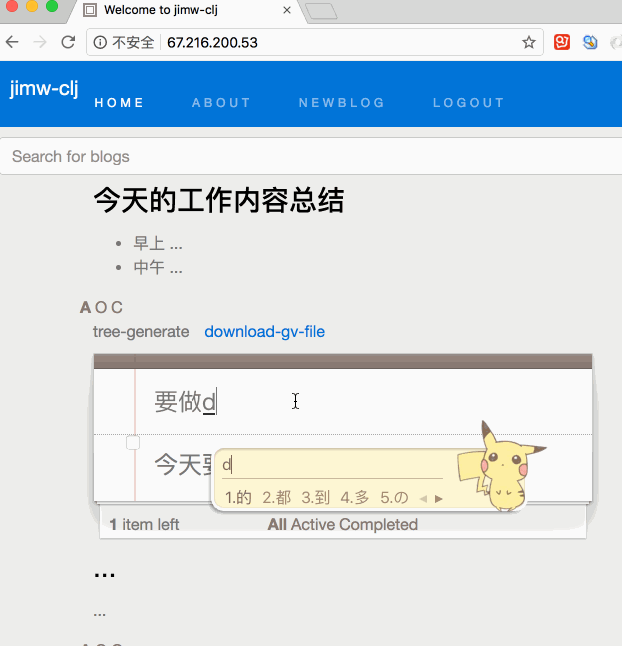
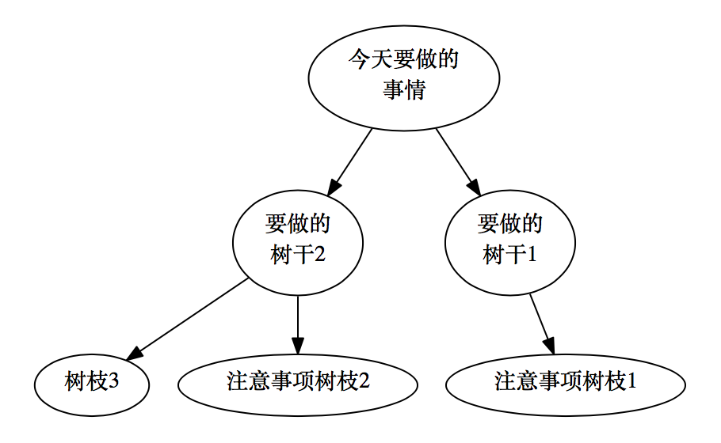

# jimw-clj: 结合机器学习做的带todos的博客 
* Power by Clojure/ClojureScript, Reagent
* 操作演示,就像聊天一样生成Lisp树

以上操作,生成如下的节点树


## Prerequisites

You will need [Leiningen][1] 2.0 or above installed.

[1]: https://github.com/technomancy/leiningen

## Running

To start a web server for the application, run:
```bash
    lein run
```
To start cljs dev compile
```bash
    lein figwheel
```
cljs product js compile
```bash
➜  jimw-clj git:(master) lein with-profile +uberjar cljsbuild once min
Compiling ClojureScript...
Compiling "target/cljsbuild/public/js/app.js" from ["src/cljc" "src/cljs" "env/prod/cljs"]...
Successfully compiled "target/cljsbuild/public/js/app.js" in 22.094 seconds.
➜  jimw-clj git:(master) ✗
``` 
## 已完成Todos
* 滑动分页 (支持手机和电脑滑动分页) √
* 排序是按照updated_at的时间来排序 (不方便cljs排序改成了按照id来排序) √
* 支持编辑文章,直接通过编辑文章列表的方式,可以预览markdown,支持手机友好编辑文章(直接双击就是编辑文章,标题和内容的编辑是分开的,离开on-blur就是保存,看到markdown的显示) √
* 每一篇文章'评论'都可以创建jimw树,把jimw和todos-tree整合得很好,可以作为todos类型的文章使用,方便复杂脑图分析(支持树干树枝评论生成树形) √
* 深度学习的学习目录todos,就像这个readme一样完成之后打钩,再看看列表就成就满满 ①  √
* 导出tree.gv文件给GraphViz看 √
* 多行输入textarea 手动，自动换行问题 √
* 登陆系统参考护理项目和clojure-web-admin (采用jwt的API验证) √
* db连接没有db的连接池5个,所以每次curd第一次都很慢 ①  (hikari-cp) √
* todos.cljs分开一个单页面来做,不然一个页面太多的atom不好控制了 => 一个atom放两级的数据,第一层是blog,第一层是todos,如果todos有内容就请求显示出来,可以在一个树上去更新两者 (采用一个atom放两级的数据,页面分开放的方法ok) √
* 为了API和单页面都可以方便使用,用jwt通用的加密方案加密API,登录成功就获取token √
* 多条件reduce搜索 √

## 未完成Todos
* 当前文章的标签云,最近一段时间的标签云(用pg_jieba分词)①
* 连接微信爬虫,每天的消息,自动提取兴趣点, 用旧的华为手机作为微信爬虫(R,Clojure,Haskell),提取兴趣点来通知消息给jimw-clj
* 连接'网页语音阅读'APP,把语音成jimw树,文章可以选择创作
* 复习前端css,不仅实用,而且要漂亮,有创作的兴趣
* 结合更多的机器学习算法来提高文章的质量,关联规则,文章自动分类等,把机器学习算法用出去到现实生活当中
* cljs图形化使得更MMA化,甚至能摆脱Google的使用
* 每天的文章的协同过滤推荐: 根据最近30天的搜索的记录,和change-log来生成协同过滤推荐
* 点击文章段落的标注,可以任意位置插入标注文本,和'网页语音阅读'一样的效果, 或者选中一句话进行标注
* 加入文章的语义网络,就像Dracket一样查看源码函数变量,显示引用
* 就像jim-emacs-fun-r-lisp的功能λ目录一样做jimw-clj功能列表
* 单个文件(单篇文章)=>独立出去文件(独立出去完整的文章)
* 搜索词记录到一张表里面,方便做文章和todos推荐 ①
* Markdown的图片上传功能,用阿里云或者直接上传服务器 ①
* 和Clojure编写的APP,收集的数据用于训练jimw-clj的习惯: '网页语音阅读'阅读网页资料 + ocr 阅读书本拍照资料等等
* 方便学习推导递归算法 => tree的算法递归的实现方式是自我推导出来的二叉树算法: <算法新解>普通算法用出去影响整个生活,更新到fp-book里面
* 用选中的文章部分文字来创建todos: 就像有道词典一样`指词即译模式（按下Ctrl键指词）`, 就创建一个todos => `var selectionObj = window.getSelection(); selectionObj.toString() `
```js
// chrome-extension://aohddidmgooofkgohkbkaohadkolgejj/lookup.js
document.addEventListener("mousemove", update_mouse_pos, true);
document.addEventListener("mouseup", on_mouse_up, true);
document.addEventListener("mousedown", on_mouse_down, true);
document.addEventListener("dblclick", on_mouse_dbclick, true);

function on_mouse_up(event) {
    if ( Math.abs(event.clientX - mouse_down_x) > 2 || Math.abs(event.clientY - mouse_down_y) > 2)
    {
        var sText = document.selection == undefined ? document.getSelection().toString():document.selection.createRange().text;
        if (sText != "")
        {
            // todo: 字符串过长的问题.
            if (sText.length >2000)
                sText = sText.substr(0, 2000);
            chrome.extension.sendRequest({action:"stroke", msg:sText}, onText);
            console.log(sText);
        }
    }
}
* 就像clojure-china一样,选中引用回复: 导入'网页语音标记阅读',用token访问jimw-clj的API,导入标记todos
```
* ClojureScript写Chrome的插件像Gooreplacer一样,帮助jimw-clj编辑: chrome-extension://jnlkjeecojckkigmchmfoigphmgkgbip/option/index.html => 写一个有道词典的cljs版本 ①
* 通过Chrome的插件调用本地的语言识别和OCR文字识别的服务
* 修改一下后端,id是updated_at的uinx时间id: 把update变成unix时间,就可以按照update的id来排序了===>> 书放在最上面的思想(默认的排序), 也提供选择排序按照创建的id(找附近创建的搜索思想) ① 可以支持两种排序方式, 按照id和updated_at的unix的数字大小排序
* 用上你所有的血与泪: 增加hichats显示,统计各个blog和todos的修改次数和增加次数
* 手机和jimw-clj流量统计
* 日志统计
* 无限滑动加载,而dom太多了,就会导致太卡了: dom 不能太多,渲染就会卡===>> 滚动加载要改成div置换就不会卡了,就像https://mobile.twitter.com/home一样,dom的数量一直保持某个数量不变,而js对象再多都没有问题,滑动的时候,js对象置换固定的dom元素

## 以实现一个优秀研究为工具目的: 量子力学研究工具诞生了MMA => 机器学习算法(.e.g:维特比算法)学习工具诞生了JIMW
* 数据流的λ化, 其他语言实现的算法的λ 化
* 数据流流向, 算法GIF演示
* 自然语言的学习能力和处理能力: 英语的学习能力, 语义网络的自动构建自动标记和学习
* 支持英文每日总结写作
* 支持英文精彩文章标注学习

## his_search_pro_code 分支: 导入安卓反编译的代码或者新的项目的代码,做搜索分析
* 每个文件都是一篇文章 -> 每个函数都是一篇文章
* jimw-clj的代码语义搜索 ①  (语义网未实现meta主谓宾) 
* 代码语义搜索,结构搜索,释放Lisp强大的原力(参考王垠的ydiff项目,如何写一个解释器,bbatsov/rubocop)
* 方便Markdown的todo和todo列表转换,todo做好了,可以导入成md文章(md的todo文章,可以转为todo列表,打钩编辑单条等): `*`标签的文章,批量导入到todos的功能,以及把todos只有一级的导出到`*`标签的文章
* 所有的事件操作都有操作异步记录, 以便做`数据可视化`,树形网络,曲线,地图等等, 自我数据分析分析为元,自画像为中线打机器学习
* 搜索下拉推荐提示,自动补全提示
* 多个项目的代码可以并存, blog加一个类别字段
* 多关键词搜索时,搜索博客结果的关键词会全部高亮
* 多关键词搜索时,显示下拉列表,显示关键的当前行
* 关键词搜索结果,相关系数越高的,排越前面
* 提交的`git log`数据分析
* 手机上的语音标记todo,可以上传GPS,陀螺仪等等传感器数据到jimw-clj的API分析
* 练拳的照片和录音,还有运动记录,在线更新到jimw-clj上分析

## 借力打力
* 借助了太阳的引力才能甩出太阳系: 用re-frame来新构造jimw-clj的cljs系统

## License

Copyright © 2017 FIXME
